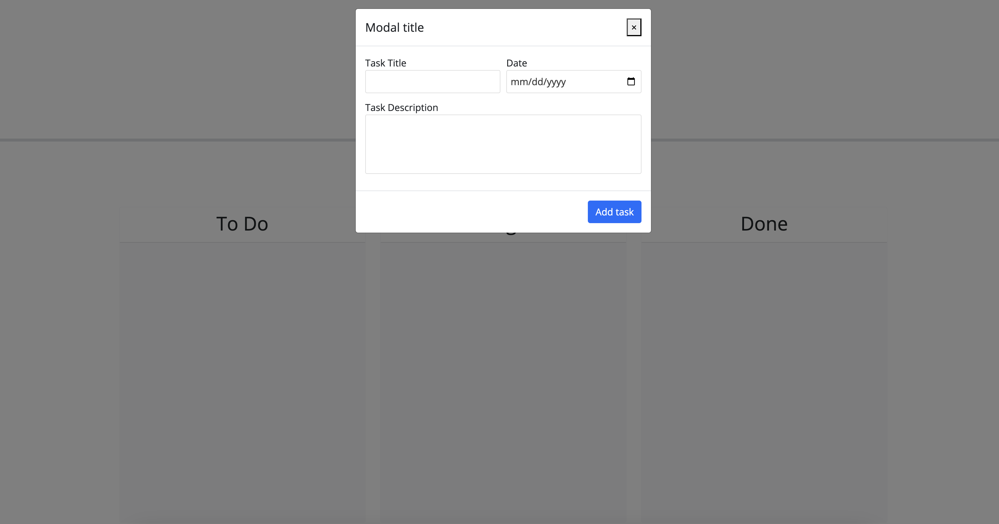
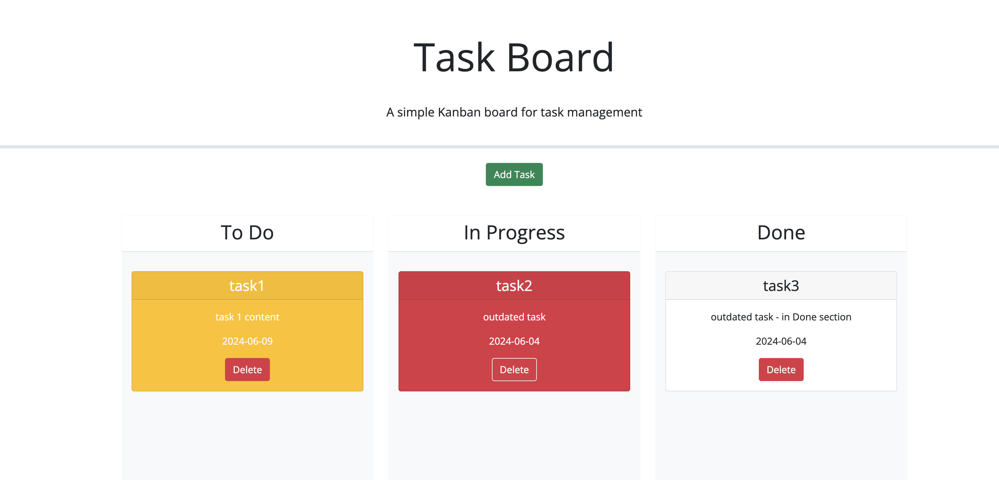

# Task Board

## Link to applicaiton
https://jonghobae0218.github.io/Task_board/

## Descripiton & Feature
When opened, this application looks through the local storage and shows existing task. 

When pressing Add, it shows modal that receives data from user. 

When adding a task, it is saved to to-do section.

Each task card has it's background color based on its due date. If it is not done, and is past the due date, it is red. If it is not done and is due today, it is yellow. In other cases, it is white. 

When clicking delete button, the task is removed.

When dragging it to anothe section, it moves.

